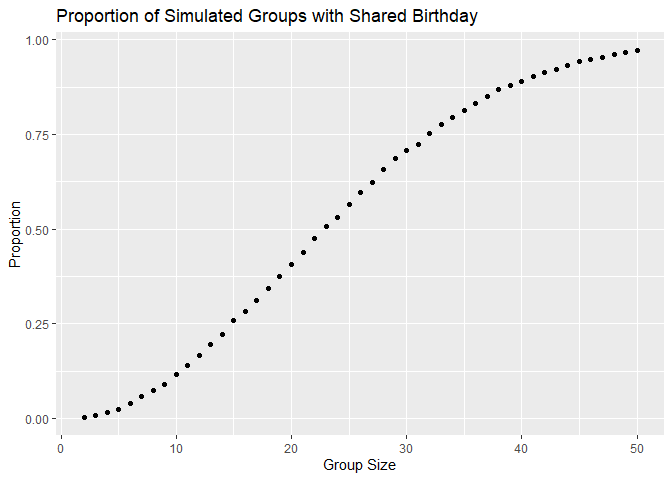
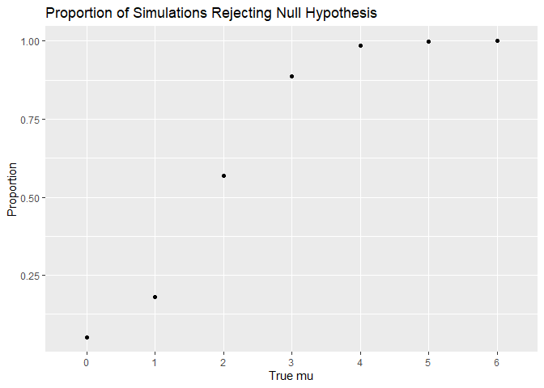
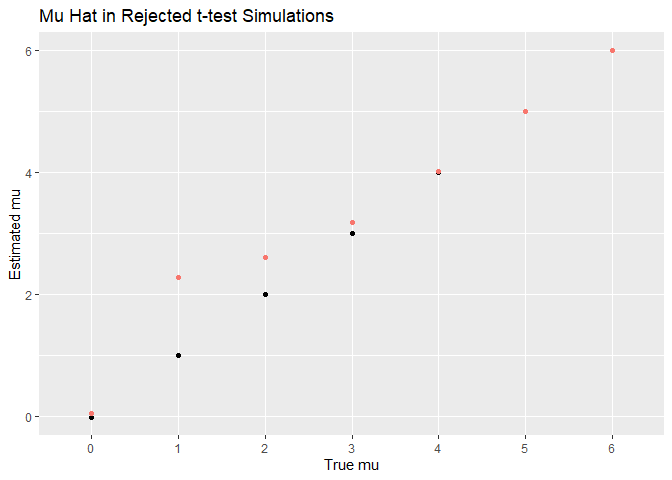
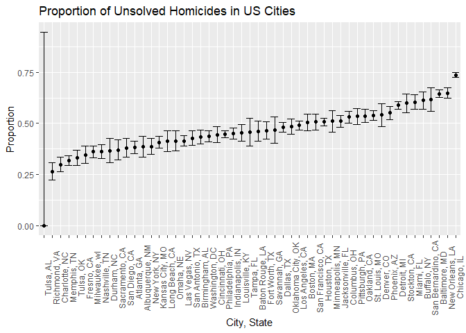

Birthday Simulation
================
Wayne Monical
2024-11-13

In this project, we create a function to simulate whether a group of a
given size has at least one shared birthday, assuming birthdays are
evenly spread among the 365 days of the year. In reality, birthdays are
not spread evenly across days of the year, so you are actually more
likely to share a birthday than this analysis suggests. But for this
analysis we will stick with that assumption for simplicity. We simulate
this by random drawing birthdays 10,000 times for each group size
between 2 and 50. Plotting the results of the simulation, we see that
the proportion of simulations with at least one shared birthday rises
smoothly from close to zero to close to one with increasing group size.

First we create a function for simulating a shared birthday.

``` r
n_test = 25

birthday = function(n = 25){
  birthdays = sample(x = 1:365, 
                     size = n,
                     replace = TRUE)
  return(length(unique(birthdays)) < n)
}
```

The, we run the simulation 10,000 times for each size between 2 and 50.

``` r
group_size = 2:50
n_sim = 10000

sims = 
    matrix(
      0,
      nrow = max(group_size) - min(group_size) + 1,
      ncol = n_sim,
      dimnames = list(group_size, NULL))

for(i in group_size){
  for(j in 1:n_sim){
    sims[as.character(i),j] = as.integer(birthday(n = i))
  }
}
```

We then take the average proportion of groups with at least one shared
birthday for each group size.

``` r
sim_results = data.frame(
  group_size = group_size,
  prop_shared_bday = rowMeans(sims)
)
```

We plot the results and observe that the proportion of simulated groups
with a shared birthday rises smoothly from close to zero to close to one
with increasing group size.

``` r
ggplot(
  sim_results, 
  aes(x = group_size, y = prop_shared_bday))+
  geom_point() + 
  ggtitle('Proportion of Simulated Groups with Shared Birthday') +
  xlab('Group Size') + 
  ylab('Proportion')
```

<!-- -->

## T-Test Simulation

The t-test is the most applicable statistical test. We will evaluate its
effectivenss with simulation. We begin by simulating a normal
distribution a large number of times with various true means. We then
conduct t-tests as to whether the true mean of the simulated samples is
different from zero.

We begin by specifying parameters for the simulation.

``` r
n_2 = 30
sd_2 = 5
mu_2 = 0

sim_size = 5000
```

We then conduct the simulation.

``` r
n_2 = 30
sd_2 = 5
mu_2 = 0

sim_size = 5000

sim2a = 
  tibble(
    id = 1:sim_size,
    mu = mu_2
    ) |> 
  mutate(
    sim = map(mu, \(x) rnorm(n = n_2, mean = x, sd = sd_2))
  )
```

We find the sample average for each simulation and apply a t-test.

``` r
sim2a = 
  sim2a |> 
  mutate(
    test = map(
      sim,
      \(x) broom::tidy(
        t.test(
          x = x,
          alternative = 'two.sided',
          mu = 0,
          conf.leve = 0.95
        )))) |> 
  unnest(test)
```

We repeat this process for various true means equal to 0 through 6.

``` r
mu = data.frame(mu = 0:6)
sim_id = data.frame(id = 1:sim_size)

sim2b = 
  crossing(mu, sim_id) |> 
  mutate(
    sim = map(mu, \(x) rnorm(n = n_2, mean = x, sd = sd_2)),
    test = map(
      sim,
      \(x) broom::tidy(
        t.test(
          x = x,
          alternative = 'two.sided',
          mu = 0,
          conf.level = 0.95
        )))
  ) |> 
  unnest(test) |> 
  mutate(reject_null = p.value < 0.05)
```

Power is defined as the probability of a test successfully rejecting the
null hypothesis. By taking the proportion of simulations that reject the
null hypothesis for known true means, we can approximate the power of
the test. Plotting this power estimation, we see that it increases as
the difference between the true mean and the null hypothesis mean
increases. The proportion of simulations that rejected the null
hypothesis when the true mean was equal to zero is approximately 0.05,
the alpha value of the specified t-test, also known as the type I error.

``` r
sim2b |> 
  group_by(mu) |> 
  summarize(
    proportion_reject_null = mean(reject_null, na.rm = TRUE)
    ) |> 
  ggplot(aes(x = as.character(mu), y = proportion_reject_null)) +
  geom_point() + 
  ggtitle('Proportion of Simulations Rejecting Null Hypothesis') +
  xlab('True mu') + 
  ylab('Proportion')
```

<!-- -->

Plotting the average estimated mean from each simulation against their
true means (the points given in black), we see that they align closely.
Plotting the average estimated mean among simulations that rejected the
null hypothesis (points given in red), we see a variety of effects.
Where the true mean is zero, the average estimated mean is close to
zero. This may be due to the facts that the true mean is indeed zero and
the t-tests were conducted as two-sided, therefore there were
approximately as many type I errors on both tails, and their average was
approximately zero. Among simulated samples with true means equal to 1
and 2, the estimates of the mean are significant larger than the true
means. Since the power of these tests were smaller, it took
exceptionally large values in order to reject the null hypothesis. Among
simulations with a true mean equal to 3, 4, and 5, the average estimate
of the mean was approximately equal to the true mean. Since these tests
had higher powers, most of the simulations succeeded in rejecting the
null hypothesis, and therefore the means of these estimates aligned more
closely with the true means.

``` r
null_reject_ests = 
  sim2b |> 
  filter(reject_null) |> 
  group_by(mu) |> 
  summarize(mu_hat = mean(estimate))


sim2b |> 
  group_by(mu) |> 
  summarize(mu_hat = mean(estimate)) |> 
  ggplot(aes(x = as.character(mu), y = mu_hat)) +
  geom_point() +
  geom_point(data = null_reject_ests, aes(color = 'red'))+
  ggtitle("Mu Hat in Rejected t-test Simulations") + 
  xlab("True mu") + 
  ylab('Estimated mu') + 
  theme(legend.position="none")
```

<!-- -->

## Homicide Analysis

This data set contains 52,179 victims of homicide across 50 US cities.
There is data on the victims’ names, ages, races, and sexes. There is a
latitude and longitude given for each homicide and a variable titled
`disposition` indicating the result of the homicide’s investigation.

We begin by reading in the homicide data.

``` r
homicide = read_csv('homicide-data.csv')
```

    ## Rows: 52179 Columns: 12
    ## ── Column specification ────────────────────────────────────────────────────────
    ## Delimiter: ","
    ## chr (9): uid, victim_last, victim_first, victim_race, victim_age, victim_sex...
    ## dbl (3): reported_date, lat, lon
    ## 
    ## ℹ Use `spec()` to retrieve the full column specification for this data.
    ## ℹ Specify the column types or set `show_col_types = FALSE` to quiet this message.

We create the `city_state` variable.

``` r
homicide = 
  homicide |> 
  mutate(city_state = paste0(city, ", ", state)) |> 
  mutate(
    unsolved = disposition %in% c(
      'Closed without arrest',
      'Open/No arrest'))
```

We count the total number of homicides and the number of unsolved
homicides for each city.

``` r
homicide |> 
  group_by(city_state) |> 
  summarize(
    total = n(),
    unsolved = sum(unsolved)
    ) |> 
  knitr::kable()
```

| city_state         | total | unsolved |
|:-------------------|------:|---------:|
| Albuquerque, NM    |   378 |      146 |
| Atlanta, GA        |   973 |      373 |
| Baltimore, MD      |  2827 |     1825 |
| Baton Rouge, LA    |   424 |      196 |
| Birmingham, AL     |   800 |      347 |
| Boston, MA         |   614 |      310 |
| Buffalo, NY        |   521 |      319 |
| Charlotte, NC      |   687 |      206 |
| Chicago, IL        |  5535 |     4073 |
| Cincinnati, OH     |   694 |      309 |
| Columbus, OH       |  1084 |      575 |
| Dallas, TX         |  1567 |      754 |
| Denver, CO         |   312 |      169 |
| Detroit, MI        |  2519 |     1482 |
| Durham, NC         |   276 |      101 |
| Fort Worth, TX     |   549 |      255 |
| Fresno, CA         |   487 |      169 |
| Houston, TX        |  2942 |     1493 |
| Indianapolis, IN   |  1322 |      594 |
| Jacksonville, FL   |  1168 |      597 |
| Kansas City, MO    |  1190 |      486 |
| Las Vegas, NV      |  1381 |      572 |
| Long Beach, CA     |   378 |      156 |
| Los Angeles, CA    |  2257 |     1106 |
| Louisville, KY     |   576 |      261 |
| Memphis, TN        |  1514 |      483 |
| Miami, FL          |   744 |      450 |
| Milwaukee, wI      |  1115 |      403 |
| Minneapolis, MN    |   366 |      187 |
| Nashville, TN      |   767 |      278 |
| New Orleans, LA    |  1434 |      930 |
| New York, NY       |   627 |      243 |
| Oakland, CA        |   947 |      508 |
| Oklahoma City, OK  |   672 |      326 |
| Omaha, NE          |   409 |      169 |
| Philadelphia, PA   |  3037 |     1360 |
| Phoenix, AZ        |   914 |      504 |
| Pittsburgh, PA     |   631 |      337 |
| Richmond, VA       |   429 |      113 |
| Sacramento, CA     |   376 |      139 |
| San Antonio, TX    |   833 |      357 |
| San Bernardino, CA |   275 |      170 |
| San Diego, CA      |   461 |      175 |
| San Francisco, CA  |   663 |      336 |
| Savannah, GA       |   246 |      115 |
| St. Louis, MO      |  1677 |      905 |
| Stockton, CA       |   444 |      266 |
| Tampa, FL          |   208 |       95 |
| Tulsa, AL          |     1 |        0 |
| Tulsa, OK          |   583 |      193 |
| Washington, DC     |  1345 |      589 |

We estimate the proportion of unsolved homicides in Baltimore, Maryland.

``` r
baltimore = 
  homicide |> 
  filter(city_state == 'Baltimore, MD')

baltimore_unsolved = 
  baltimore |> 
  pull(unsolved) |> 
  sum() |> 
  prop.test(n = nrow(baltimore))  
  
baltimore_unsolved |> 
  broom::tidy() |> 
  select(estimate, conf.low, conf.high)
```

    ## # A tibble: 1 × 3
    ##   estimate conf.low conf.high
    ##      <dbl>    <dbl>     <dbl>
    ## 1    0.646    0.628     0.663

``` r
 homicide |> 
  filter(city_state == 'Tulsa, AL')
```

    ## # A tibble: 1 × 14
    ##   uid   reported_date victim_last victim_first victim_race victim_age victim_sex
    ##   <chr>         <dbl> <chr>       <chr>        <chr>       <chr>      <chr>     
    ## 1 Tul-…      20160930 HARRIS      LESLIE       White       41         Female    
    ## # ℹ 7 more variables: city <chr>, state <chr>, lat <dbl>, lon <dbl>,
    ## #   disposition <chr>, city_state <chr>, unsolved <lgl>

We conduct the same procedure on all cities in the data setusiong a tidy
pipeline. There is one city for which this statistical procedure is not
valid, namely Tulsa, AL. This city has only one recorded homicide, which
is solved.

``` r
unsolved_props=
  homicide |> 
  nest(data = -city_state) |> 
  mutate(prop_test = map(data, 
                        \(x) x |> 
                          pull(unsolved)|> 
                          sum() |> 
                          prop.test(n = nrow(x))),
         test_results = map(prop_test, \(x) broom::tidy(x)),
         ) |> 
  unnest(cols = test_results) |> 
  select(
    city_state, estimate, conf.low, conf.high
  )  
```

    ## Warning: There was 1 warning in `mutate()`.
    ## ℹ In argument: `prop_test = map(data, function(x) prop.test(sum(pull(x,
    ##   unsolved)), n = nrow(x)))`.
    ## Caused by warning in `prop.test()`:
    ## ! Chi-squared approximation may be incorrect

We create a chart showing the estimate of unsolved homicides with error
bars showing a 95% confidence interval. The cities are organize by the
proportion of unsolved homicides.

``` r
unsolved_props |> 
  ggplot(aes(
    x = reorder(city_state, estimate),
    y = estimate))  +  
  geom_point() + 
  geom_errorbar(aes(ymin = conf.low, ymax = conf.high))+
  theme(axis.text.x = element_text(angle = 90))+
  ggtitle("Proportion of Unsolved Homicides in US Cities") + 
  xlab('City, State') + 
  ylab('Proportion')
```

<!-- -->
